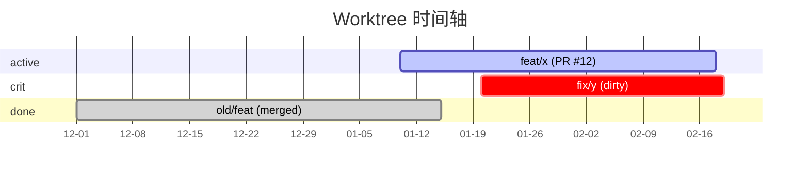

# 列出所有 Worktree 状态

一眼看清所有 worktree 的当前状态，并识别可清理的过期分支。

## Step 0：定位主仓库

```bash
MAIN_REPO=$(git worktree list | head -1 | awk '{print $1}')
```

在主仓库或任意 worktree 下执行均可。

## Step 1：批量采集数据

对每个 worktree（跳过主仓库自身）执行：

```bash
git worktree list --porcelain          # 列出所有 worktree
git fetch origin                       # 同步远端状态

# 对每个 worktree 采集：
git -C <path> status --short           # DIRTY
git -C <path> rev-list origin/main..HEAD --count   # AHEAD
git -C <path> rev-list HEAD..origin/main --count   # BEHIND
git -C <path> log -1 --format="%ai"               # 最近 commit 时间
git -C <path> log --format="%ai" $(git -C <path> merge-base HEAD origin/main) -1  # 分叉时间
gh pr view --json state,url,number -R <repo> -b <branch> 2>/dev/null  # PR 状态
```

## Step 2：输出表格

```
worktree            branch          ahead  behind  dirty  PR
────────────────────────────────────────────────────────────────
worktrees/feat-x    feat/x          +3     -0      ✗      #12 open
worktrees/fix-y     fix/y           +0     -5      ✓      none
worktrees/old-feat  old/feat        +1     -12     ✗      #8 merged ⚠
```

状态标注：
- `⚠` = PR 已 merged/closed，建议清理
- `✓` dirty = 有未提交改动
- behind 较多 = 落后 main，建议 rebase

## Step 3：输出 Mermaid 时间轴

根据采集的分叉时间和最近 commit 时间，生成 gantt 图：

```
gantt 图规则：
- 每个 worktree 一行
- 起点 = 分叉时间（从 main 创建分支的时间）
- 终点 = 最近 commit 时间（或今天）
- 颜色（section）：
    active   = PR open
    done     = PR merged/closed（可清理）
    crit     = dirty（有未提交改动）
    默认     = 无 PR，开发中
```

示例输出：

````

````

## Step 4：清理建议

列出状态为 `merged` 或 `closed` 的 worktree，提示可执行 `wtrm`：

```
⚠ 以下 worktree 对应的 PR 已关闭，可以清理：
  - worktrees/old-feat (old/feat) → PR #8 merged
    执行：/wtrm old/feat
```
