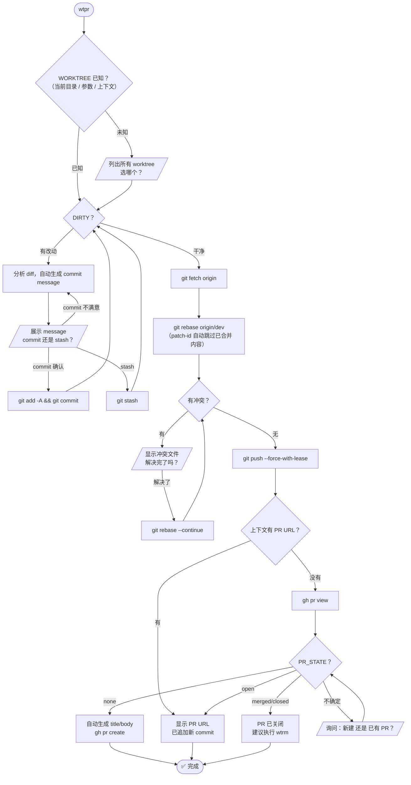

# wtpr 流程原型图

完整状态机，用于理解 wtpr 的逻辑结构。

## 设计原则

- **单一出口**：所有路径收敛到 `✅ 完成`，Ctrl+C 是唯一退出方式
- **只问"怎么做"**：交互节点不问"要不要做"，只问"怎么继续"
- **所有循环有终点**：DIRTY 循环、冲突循环、message 确认循环均在用户操作后收敛
- **无条件 rebase**：`git rebase origin/dev` 内部通过 patch-id 处理所有情况，无需预判
