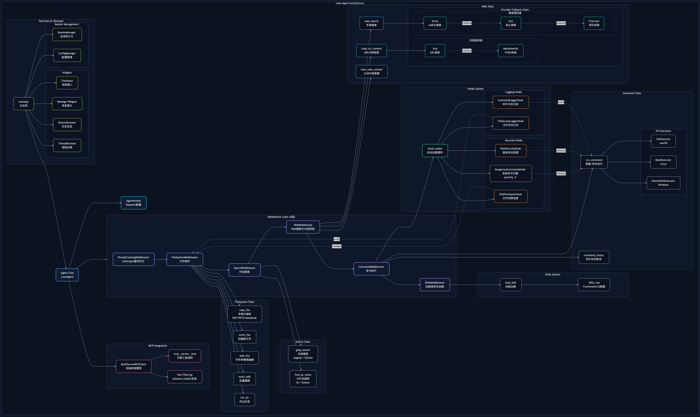

# LEON (Lane Runtime)

LEON 是一个面向企业级生产可用的 Agent Runtime：用于构建、运行与治理一组可长期运行的 Agent，并把它们当作可持续协作的 co-workers 来管理与调度。

LEON 以 LangChain Middleware 为核心架构：通过统一的 middleware 管线完成 tool 注入、运行时校验、安全拦截、上下文装载/卸载与可观测性。



## 快速开始

### 安装

```bash
uv tool install -U leonai   # 安装/更新
leonai                      # 启动
```

首次运行会自动进入配置向导，支持 OpenAI 兼容格式的 API（OpenAI、Claude via proxy、DeepSeek 等）。

### 基础使用

```bash
# 使用默认配置启动
leonai

# 使用预设 Agent
leonai --agent coder        # 代码开发（Opus, temp=0.0）
leonai --agent researcher   # 研究分析（Sonnet, 只读）
leonai --agent tester       # 测试 QA

# 使用虚拟模型名
leonai --model leon:fast       # 快速响应（Sonnet, temp=0.7）
leonai --model leon:balanced   # 平衡模式（Sonnet, temp=0.5）
leonai --model leon:powerful   # 强大推理（Opus, temp=0.3）
leonai --model leon:coding     # 代码生成（Opus, temp=0.0）

# 配置管理
leonai config            # 交互式配置
leonai config show       # 查看当前配置
```

### 配置文件位置

- **用户配置**: `~/.leon/config.json` - API 密钥和个人偏好
- **项目配置**: `.leon/config.json` - 项目特定设置

### 快速配置示例

**最小配置** (`~/.leon/config.json`):
```json
{
  "api": {
    "api_key": "${OPENAI_API_KEY}",
    "model": "leon:balanced"
  }
}
```

**开发环境** (`.leon/config.json`):
```json
{
  "api": {
    "model": "leon:coding",
    "allowed_extensions": ["py", "js", "ts", "json", "yaml"]
  },
  "tools": {
    "web": {
      "enabled": false
    }
  }
}
```

**生产环境** (`.leon/config.json`):
```json
{
  "api": {
    "model": "claude-opus-4-6",
    "enable_audit_log": true,
    "block_dangerous_commands": true
  },
  "tools": {
    "filesystem": {
      "tools": {
        "write_file": false,
        "edit_file": false
      }
    },
    "command": {
      "enabled": false
    }
  }
}
```

详见 [配置文档](docs/configuration.md) 和 [迁移指南](docs/migration-guide.md)

## 最小基座

LEON 认为一个真正可工作的 Agent，至少应具备三类基础能力：

- Web
- Bash
- File System

## 架构方式

- Middleware-first：tool schema 注入、参数/路径校验（Fail Fast）、hooks/policy 拦截、结果整形、可观测性
- 三层配置系统：系统默认 + 用户配置 + 项目配置，支持虚拟模型映射和 Agent 预设

## 核心特性

### 配置系统

LEON 采用三层配置系统，通过 JSON 配置文件统一管理 Agent 能力：

```json
// ~/.leon/config.json (用户配置)
{
  "api": {
    "model": "claude-sonnet-4-5-20250929",
    "api_key": "${OPENAI_API_KEY}",
    "temperature": 0.5,
    "enable_audit_log": true
  },
  "tools": {
    "filesystem": {
      "enabled": true,
      "tools": {
        "read_file": { "enabled": true, "max_file_size": 10485760 },
        "write_file": true,
        "edit_file": true
      }
    },
    "web": {
      "enabled": true,
      "tools": {
        "web_search": {
          "enabled": true,
          "tavily_api_key": "${TAVILY_API_KEY}"
        }
      }
    }
  },
  "mcp": {
    "enabled": true,
    "servers": {
      "github": {
        "command": "npx",
        "args": ["-y", "@modelcontextprotocol/server-github"],
        "env": { "GITHUB_TOKEN": "${GITHUB_TOKEN}" }
      }
    }
  }
}
```

**特性**：
- 三层配置合并（系统默认 + 用户配置 + 项目配置）
- 虚拟模型映射（`leon:fast/balanced/powerful/coding/research/creative`）
- 环境变量展开 (`${VAR}`)
- Pydantic 强类型验证
- 工具级别的细粒度控制
- CLI 参数可覆盖配置
- 内置 Agent 预设（default/coder/researcher/tester）

详见 [配置文档](docs/configuration.md)、[迁移指南](docs/migration-guide.md) 和 [配置示例](examples/configs/)

### Skills 系统

渐进式能力披露机制，按需加载专业技能：

```
skills/
├── code-review/
│   └── SKILL.md
└── git-workflow/
    └── SKILL.md
```

**SKILL.md 格式**：
```markdown
---
name: code-review
description: 代码审查专家技能
---

# Code Review Skill

## Instructions
...
```

**特性**：
- Frontmatter 元数据解析
- 启用/禁用控制
- 多路径支持
- 动态加载（`load_skill` 工具）

### MCP (Model Context Protocol) 支持

集成外部 MCP 服务器，扩展 Agent 能力：

```yaml
mcp:
  servers:
    github:
      command: npx
      args: ["-y", "@modelcontextprotocol/server-github"]
      env:
        GITHUB_TOKEN: ${GITHUB_TOKEN}
      allowed_tools:
        - create_issue
        - list_issues
```

**特性**：
- 多服务器支持
- 工具白名单（`allowed_tools`）
- 环境变量配置
- 自动工具前缀处理（`mcp__server__tool`）

### TUI 界面

基于 Textual 的现代化终端界面：

| 快捷键 | 功能 |
|--------|------|
| `Enter` | 发送消息 |
| `Shift+Enter` | 换行 |
| `Ctrl+↑/↓` | 浏览历史 |
| `Ctrl+Y` | 复制最后消息 |
| `Ctrl+E` | 导出对话 |
| `Ctrl+L` | 清空历史 |
| `Ctrl+T` | 切换对话 |
| `ESC ESC` | 显示历史浏览器 |

**特性**：
- 实时流式输出
- Markdown 渲染
- 工具调用可视化
- Thread 持久化与恢复
- 消息导出

### Middleware 架构

10 层中间件栈，统一处理工具注入、校验、拦截：

```
┌─────────────────────────────────────┐
│ 1. SteeringMiddleware (队列注入)    │
│ 2. PromptCachingMiddleware (缓存)   │
│ 3. FileSystemMiddleware (文件)      │
│ 4. SearchMiddleware (搜索)          │
│ 5. WebMiddleware (Web)              │
│ 6. CommandMiddleware (命令)         │
│ 7. SkillsMiddleware (技能)          │
│ 8. TodoMiddleware (任务追踪)        │
│ 9. TaskMiddleware (子Agent)         │
│10. MonitorMiddleware (监控)         │
└─────────────────────────────────────┘
```

### 内置工具

| 类别 | 工具 | 说明 |
|------|------|------|
| **文件** | `read_file` | 读取文件（支持 PDF/PPTX/Notebook） |
| | `write_file` | 创建新文件 |
| | `edit_file` | 编辑文件（str_replace 模式） |
| | `multi_edit` | 批量编辑 |
| | `list_dir` | 列出目录 |
| **搜索** | `grep_search` | 内容搜索（ripgrep/Python） |
| | `find_by_name` | 文件名搜索（fd/Python） |
| **Web** | `web_search` | Web 搜索（Tavily/Exa/Firecrawl） |
| | `read_url_content` | 获取 URL 内容（Jina） |
| **命令** | `run_command` | 执行 Shell 命令 |
| | `command_status` | 查询命令状态 |
| **技能** | `load_skill` | 加载专业技能 |

### 安全机制

多层安全防护：

1. **命令拦截**：危险命令黑名单（`rm -rf`, `sudo` 等）
2. **路径安全**：强制绝对路径，Workspace 限制
3. **文件权限**：扩展名白名单
4. **审计日志**：文件访问和命令执行记录

```yaml
agent:
  allowed_extensions: [py, txt, md]  # 扩展名白名单
  block_dangerous_commands: true     # 拦截危险命令
  block_network_commands: true       # 拦截网络命令
  enable_audit_log: true             # 启用审计日志
```

### 多格式支持

| 格式 | 读取器 |
|------|--------|
| 文本 | TextReader |
| PDF | PDFReader (pymupdf) |
| PPTX | PPTXReader (python-pptx) |
| Notebook | NotebookReader |
| 二进制 | BinaryReader |

### 多搜索引擎

降级策略自动切换：

1. **Tavily**（主力）
2. **Exa**（备选）
3. **Firecrawl**（兜底）

### 多 Shell 支持

自动检测操作系统，选择合适的执行器：

- **macOS**: ZshExecutor
- **Linux**: BashExecutor
- **Windows**: PowerShellExecutor

### Sandbox 沙箱系统

在隔离环境中运行 Agent 操作，支持三种 Provider：

```bash
leonai --sandbox docker     # 本地 Docker 容器
leonai --sandbox e2b        # E2B 云沙箱
leonai --sandbox agentbay   # 阿里云 AgentBay

leonai sandbox ls            # 查看所有会话
leonai sandbox pause <id>    # 暂停会话
leonai sandbox resume <id>   # 恢复会话
```

**特性**：
- 会话自动暂停/恢复，跨重启保持状态（文件、安装的包等）
- 恢复 Thread 时自动检测沙箱 Provider（无需重复传 `--sandbox`）
- SQLite 持久化会话映射
- 详见 [docs/SANDBOX.md](docs/SANDBOX.md)

## 更新日志

### v0.3.0 (2026-02-09) - 230 commits

**🌟 主要新增**：
- **SummaryStore**：持久化对话记忆，自动恢复，Split Turn 检测（88% 覆盖率，28 测试）
- **Terminal Persistence**：终端会话持久化，跨重启保持状态，pause/resume 支持
- **Web Chat UI**：FastAPI + React 全功能 Web 界面，实时聊天，沙箱管理
- **Monitor Middleware**：6 维度 token 追踪，动态成本计算（OpenRouter API + 314 模型缓存）
- **Queue Mode**：5 种优先级消息队列（steer/followup/collect/backlog/interrupt）

**🐛 关键修复**：
- 修复 checkpointer 初始化顺序问题
- 修复沙箱 read_file 崩溃
- 修复 MCP 工具白名单过滤
- 修复 thread_id 追踪（ContextVar）

**🔧 架构优化**：
- 沙箱提升为基础设施层
- 解耦 sandbox/middleware 依赖
- 替换 shell middleware 为 command middleware

**📊 性能**：
- SummaryStore 查询 ~0.12ms（目标 <50ms）
- SummaryStore 写入 ~3.8ms（目标 <100ms）

[完整 Release Notes](./RELEASE_NOTES_v0.3.0.md)

---

### v0.2.3 及更早版本

**v0.2.3** - 配置向导美化，Rich UI 集成
**v0.2.0** - Agent Profile 系统，Skills 渐进式披露，MCP 集成
**v0.1.0** - 初始版本，Middleware 架构，TUI 界面，基础工具集

---

## 路线

**已完成**：
- [x] Agent Profile：配置化、强类型校验、统一能力入口
- [x] TUI Resume：恢复 thread（仅 messages/thread）
- [x] MCP 集成：可配置加载、工具白名单
- [x] Skills 系统：渐进式能力披露
- [x] Sandbox 沙箱：Docker / E2B / AgentBay，会话管理，自动恢复
- [x] SummaryStore：持久化对话记忆，自动恢复
- [x] Terminal Persistence：终端会话持久化
- [x] Web Chat UI：FastAPI + React 界面

**进行中**：
- [ ] Hook 系统：工具调用前后的拦截与扩展
- [ ] Plugin 适配：第三方插件生态支持
- [ ] 评估系统：Agent 能力评测与基准测试
- [ ] 基于轨迹的自动优化：从执行轨迹学习，自动优化 Agent 框架
- [ ] Agent 协作与调度：多 Agent 协同工作与任务分配

## 许可证

MIT License
