# Leon Agent Architecture

本文档描述 Leon Agent 的整体架构设计。

## 架构概览

```mermaid
graph TB
    %% =========================
    %% Leon Agent Architecture (Updated)
    %% =========================

    subgraph ARCH["Leon Agent Architecture"]
        Agent["Agent Core<br/>LeonAgent"]
        Profile["AgentProfile<br/>Pydantic配置"]

        subgraph MID["Middleware Layer (6层)"]
            PromptCache["PromptCachingMiddleware<br/>Anthropic缓存优化"]
            FileSystem["FileSystemMiddleware<br/>文件操作"]
            Search["SearchMiddleware<br/>代码搜索"]
            Web["WebMiddleware<br/>Web搜索与内容获取"]
            Command["CommandMiddleware<br/>命令执行"]
            Skills["SkillsMiddleware<br/>技能渐进式加载"]
        end

        subgraph FS["FileSystem Tools"]
            ReadFile["read_file<br/>多格式读取<br/>PDF/PPTX/Notebook"]
            WriteFile["write_file<br/>创建新文件"]
            EditFile["edit_file<br/>字符串替换编辑"]
            MultiEdit["multi_edit<br/>批量编辑"]
            ListDir["list_dir<br/>列出目录"]
        end

        subgraph ST["Search Tools"]
            GrepSearch["grep_search<br/>内容搜索<br/>ripgrep / Python"]
            FindByName["find_by_name<br/>文件名搜索<br/>fd / Python"]
        end

        subgraph WT["Web Tools"]
            WebSearch["web_search<br/>多源搜索"]
            ReadUrl["read_url_content<br/>URL内容获取"]
            ViewContent["view_web_content<br/>分块内容查看"]

            subgraph PROVIDERS["Provider Fallback Chain"]
                subgraph SEARCHERS["搜索提供者"]
                    Tavily["Tavily<br/>AI优化搜索"]
                    Exa["Exa<br/>语义搜索"]
                    Firecrawl["Firecrawl<br/>网页抓取"]
                end
                subgraph FETCHERS["内容提供者"]
                    Jina["Jina<br/>URL提取"]
                    Markdownify["Markdownify<br/>HTML转换"]
                end
            end
        end

        subgraph CT["Command Tools"]
            RunCmd["run_command<br/>阻塞/异步执行"]
            CmdStatus["command_status<br/>异步状态查询"]

            subgraph EXEC["OS Executors"]
                ZshExec["ZshExecutor<br/>macOS"]
                BashExec["BashExecutor<br/>Linux"]
                PSExec["PowerShellExecutor<br/>Windows"]
            end
        end

        subgraph SK["Skills System"]
            LoadSkill["load_skill<br/>技能加载"]
            SkillDefs["SKILL.md<br/>Frontmatter元数据"]
        end

        subgraph MCP["MCP Integration"]
            MCPClient["MultiServerMCPClient<br/>多服务器管理"]
            MCPTools["mcp__server__tool<br/>外部工具调用"]
            ToolFilter["Tool Filtering<br/>allowed_tools白名单"]
        end

        subgraph HOOKS["Hooks System"]
            HookLoader["Hook Loader<br/>自动加载插件"]

            subgraph SEC["Security Hooks"]
                DangerousCmd["DangerousCommandsHook<br/>危险命令拦截<br/>priority: 5"]
                PathSecurity["PathSecurityHook<br/>路径安全检查"]
                FilePermission["FilePermissionHook<br/>文件权限检查"]
            end

            subgraph LOG["Logging Hooks"]
                CmdLogger["CommandLoggerHook<br/>命令日志记录"]
                FileLogger["FileAccessLoggerHook<br/>文件访问日志"]
            end
        end

        subgraph TUI["Terminal UI (Textual)"]
            TUIApp["LeonApp<br/>主应用"]

            subgraph WIDGETS["Widgets"]
                ChatInput["ChatInput<br/>消息输入"]
                MsgWidgets["Message Widgets<br/>消息展示"]
                HistoryBrowser["HistoryBrowser<br/>历史浏览"]
                ThreadBrowser["ThreadBrowser<br/>线程切换"]
            end

            subgraph SESSION["Session Management"]
                SessionMgr["SessionManager<br/>会话持久化"]
                ConfigMgr["ConfigManager<br/>配置管理"]
            end
        end

        %% ---- Core Flows
        Agent --> Profile
        Agent --> MID

        %% ---- Middleware Chain
        PromptCache --> FileSystem
        FileSystem --> Search
        Search --> Web
        Web --> Command
        Command --> Skills

        %% ---- Middleware to Tools
        FileSystem --> ReadFile
        FileSystem --> WriteFile
        FileSystem --> EditFile
        FileSystem --> MultiEdit
        FileSystem --> ListDir

        Search --> GrepSearch
        Search --> FindByName

        Web --> WebSearch
        Web --> ReadUrl
        Web --> ViewContent
        WebSearch --> Tavily
        Tavily -.->|fallback| Exa
        Exa -.->|fallback| Firecrawl
        ReadUrl --> Jina
        Jina -.->|fallback| Markdownify

        Command --> RunCmd
        Command --> CmdStatus
        RunCmd --> ZshExec
        RunCmd --> BashExec
        RunCmd --> PSExec

        Skills --> LoadSkill
        LoadSkill --> SkillDefs

        %% ---- MCP Integration
        Agent --> MCPClient
        MCPClient --> MCPTools
        MCPClient --> ToolFilter

        %% ---- Hooks
        Command --> HookLoader
        HookLoader --> DangerousCmd
        HookLoader --> PathSecurity
        HookLoader --> FilePermission
        HookLoader --> CmdLogger
        HookLoader --> FileLogger

        DangerousCmd -.->|validate| RunCmd
        PathSecurity -.->|validate| RunCmd
        FilePermission -.->|validate| FileSystem
        CmdLogger -.->|audit| RunCmd
        FileLogger -.->|audit| FileSystem

        %% ---- TUI
        TUIApp --> Agent
        TUIApp --> ChatInput
        TUIApp --> MsgWidgets
        TUIApp --> HistoryBrowser
        TUIApp --> ThreadBrowser
        TUIApp --> SessionMgr
        TUIApp --> ConfigMgr
    end

    %% =========================
    %% Dark Theme Styling
    %% =========================

    %% Canvas / container
    style ARCH fill:#0b1220,stroke:#334155,stroke-width:2px,color:#e5e7eb
    style MID fill:#0f172a,stroke:#334155,stroke-width:1.5px,color:#e5e7eb
    style FS fill:#0f172a,stroke:#334155,stroke-width:1.5px,color:#e5e7eb
    style ST fill:#0f172a,stroke:#334155,stroke-width:1.5px,color:#e5e7eb
    style WT fill:#0f172a,stroke:#334155,stroke-width:1.5px,color:#e5e7eb
    style CT fill:#0f172a,stroke:#334155,stroke-width:1.5px,color:#e5e7eb
    style SK fill:#0f172a,stroke:#334155,stroke-width:1.5px,color:#e5e7eb
    style MCP fill:#0f172a,stroke:#334155,stroke-width:1.5px,color:#e5e7eb
    style HOOKS fill:#0f172a,stroke:#334155,stroke-width:1.5px,color:#e5e7eb
    style TUI fill:#0f172a,stroke:#334155,stroke-width:1.5px,color:#e5e7eb
    style PROVIDERS fill:#0b1324,stroke:#3b4a64,stroke-width:1.2px,color:#e5e7eb
    style SEARCHERS fill:#0b1324,stroke:#3b4a64,stroke-width:1px,color:#e5e7eb
    style FETCHERS fill:#0b1324,stroke:#3b4a64,stroke-width:1px,color:#e5e7eb
    style EXEC fill:#0b1324,stroke:#3b4a64,stroke-width:1.2px,color:#e5e7eb
    style SEC fill:#0b1324,stroke:#3b4a64,stroke-width:1.2px,color:#e5e7eb
    style LOG fill:#0b1324,stroke:#3b4a64,stroke-width:1.2px,color:#e5e7eb
    style WIDGETS fill:#0b1324,stroke:#3b4a64,stroke-width:1.2px,color:#e5e7eb
    style SESSION fill:#0b1324,stroke:#3b4a64,stroke-width:1.2px,color:#e5e7eb

    %% Key nodes
    classDef core fill:#111c33,stroke:#60a5fa,stroke-width:2px,color:#e5e7eb
    classDef profile fill:#111c33,stroke:#22d3ee,stroke-width:2px,color:#e5e7eb
    classDef middleware fill:#101a2e,stroke:#a78bfa,stroke-width:2px,color:#e5e7eb
    classDef toolNode fill:#0b1220,stroke:#94a3b8,stroke-width:1.5px,color:#e5e7eb
    classDef webNode fill:#0b1220,stroke:#38bdf8,stroke-width:1.5px,color:#e5e7eb
    classDef providerNode fill:#0b1220,stroke:#2dd4bf,stroke-width:1.5px,color:#e5e7eb
    classDef hookNode fill:#0b1220,stroke:#fb923c,stroke-width:1.5px,color:#e5e7eb
    classDef mcpNode fill:#0b1220,stroke:#f472b6,stroke-width:1.5px,color:#e5e7eb
    classDef tuiNode fill:#0b1220,stroke:#a3e635,stroke-width:1.5px,color:#e5e7eb
    classDef emphasis fill:#0b1220,stroke:#34d399,stroke-width:2px,color:#e5e7eb

    class Agent core
    class Profile profile
    class PromptCache,FileSystem,Search,Web,Command,Skills middleware
    class ReadFile,WriteFile,EditFile,MultiEdit,ListDir,GrepSearch,FindByName,RunCmd,CmdStatus,LoadSkill,SkillDefs toolNode
    class WebSearch,ReadUrl,ViewContent webNode
    class Tavily,Exa,Firecrawl,Jina,Markdownify providerNode
    class ZshExec,BashExec,PSExec toolNode
    class DangerousCmd,PathSecurity,FilePermission,CmdLogger,FileLogger hookNode
    class MCPClient,MCPTools,ToolFilter mcpNode
    class TUIApp,ChatInput,MsgWidgets,HistoryBrowser,ThreadBrowser,SessionMgr,ConfigMgr tuiNode
    class HookLoader emphasis

    linkStyle default stroke:#94a3b8,stroke-width:1.2px
```

[![](https://mermaid.ink/img/pako:eNqtWv9v00gW_1esICRWMm3zraXRHVJJW-jR0gqH7Wqvp8iJJ4lVx45spyUHSLBcoRRKy7FQWOAOWNjtrZYCq12-9Av8M3WS_hf3ZsYe24kd2rvkB5gv731m5s17b97HcCGS1yQUSUWKulgpcZkTMyoHv8OHuT-H_ZjEONJUbqiIVJMb0vMl2UR5s6oj7si5iiSaSPpqP1hUxqjm6AaGzqZP_XUmEgI9E_kblcc_Mg2yVCyt6ehPOb33OFYlQz7hKV0ryApyxO0uUZiqSaJqyvm9heXGzgbRcvXYxibGhkF5QpYkBc2LcMpxsYZ07ki_9fa7r3xL2cuVK2ZazJfwkm5PVosuBFl9SDVLulaR843tu9arB7vbD6xb99vwRmGzQs0wURng3E4LVv3-9d2td_W7y7s7j9sgBCSCJUGdNlpUd7d-bDy9Ul993Pj9eZvqNMqBHvzZogQjVGP3w23r2oK18bF5-7210r79tFYui6oEIHarBci6s7O79aJ-4-fms1vtG5-VFcXAGyeN1jMvXW5e3al_WG1-fmRtr1hLT5s7Oz4MpEqBNzoq-GzJZTRNMdpWP4tEaZR6jg7NLHMb68UP9afbsGTz9RacmbrS8Gjv1FTmm94zmolymjbbbkodfNnGm8dtD-DiI2trs37_Db3GNtURSTZtTQRNj-KrtcavP-1--K3-6HN9-Xlj-37z05029YmqYsoYA_TLuJ3FKNSGNz7uXV8J0RuXDXNY1kFLgVZWknV7t2vW9c3Gow1r596-zC1kmO-FmPqkjirMS4vQyRqkR9cj_kXdjQzocgXLcL3cVM0saWpAzKjSidoZsYwtVoBONlfLqtD1xIq1uuyBLEjBaGFHms7QsAg5D8yw48yjnO804DybqyHhhl3unK44HlfVlWxeU01IW0T33NnxjsH2tYzm01QeIOagl8WreyGsxWvWkzXbpP9-2Xh8syXt-Y45dXby67HhkbMCTWVzsgSJb1RUlJyYn-XSJVFuN77_6kdwWqcA9Mz1ldXdT4-alxcCFfEvI87JSg0UaIPmyjGaHkPsxgLlvAh68CdRar5-tfvxxhdURmUd5XVxXiEpwW4T9cbOnb1nf9SX7gaZmjlH6NFHRzLOyW1zf_Hkf5FVvH_8l3PfoBS2PAltUZ-VtHlVLmCDeXpE_1RmYry58ytkhv3t3zcQ5vrpjJvMwzJnVU2Xcc7Xqyp4HxElG9p7sGU9-1evtf1d_dXLkKQPmoIpmlWc923drEEGqAMT3cbSu_rlK-DAzdfPOznwyDcjacCZFMA1UL5qaroRaIpvjRIWAFG7hUXJemUxPykE6pwQmZLTZFrjslo9H6g1Jdg6U9o80oUSUhSf5jSkK22-fZf7uhvhNHssOfq2tSd1TZSIBE7r0M4auON5UAPeUfYWD6MCeY5Pj42P95TpnY7qkF7Komki3Vq4Wr_3pr68sa8cOpGewj6bnuLGID_BmCkH5HKYTysyzWjkIROQPod0NsyS6uNla-mZ9XC9sfGssXotCIc4K34D85UspGQMk82aMGhj3N-7um69f2ktvG--udr4fr0NAwPAOwwnxdkJOhztQW1HICAxwqVKBNNoPNyBN8Za3t8beWpy8jROFaegdAi9OzyJ74-sjzsc7dFsd_0Xa2md3l595Z9OHRESGAKJCwEcD0qRGkEOjoxhUS0iXasaNKLdLg1NA2tS-y2_3Xv4H7ueu_lTffEXMlzRZQ0vkeKSwfEgmiVnGzgqPF0G3Xz_2vr0D2vjhrWwXv_xMoR9IBQukaaQXpYNAzzJLvHcAQZnF8tPru49XA2Ba7kmn-nGJ09inqIVi3DvHSwHBsNC5LJsa9G-azJqrLWX1ue15sab1nrKey6GhDtD-TwyjBYweqrmxue9tQ0K-b_lkMy5Mezd2GyqqHDnxrgjGXTerIpKO9kB2aFKxWZt0KKE4sOWtfm9Ez8hRpweGz45ksEePy1LRWSGmLAkmmNqpYqDn7Xpad8t1q-8bn66ay0EO8OEUbSRceIAc4lFxNkjHgTr7b3Gi81AhFNQ9Gp67YQO6ZhGnG-A3uDta9bKb_U_Vpo_LwaCZEq4knMxfH1aZmx-bqzftBavBz3TnfxQGBGEsckzJIyJg0M1oMIpy60M2OWBRGyiqLs6VIXuZHf7h-brJ_VbV3Y_LgRRUcrn1IJcpBB224NAiXRIBu7kfYcPc0fhR7g8N6rgB9DP9mH6uEPlg6aApAfheVg7rVbVAJ5OAFw66Mp4KCIWoSW9O21TGjwFBb87jnkBHrSD3p1wqiYCRl7pL-zZ1OwKK2xLDkcNFWCsM1TCIZehAow-hkrYRNF7GI9tXHIXOO2SNa--Y0PGpNqnbLLUPuGhQb5Jz6KUWriztM8d7Tl6_GLB5jcXMZ1wRaDTOs_4gitlb4osgut4dwb3WgE8Bbv38F4_obV08BwrlT3rE3Eya1eygXNOwRo4SUtU323SkpLctVM_urNsyHVsXCgG-nZLtRcUyU5l506yIUegJSj8826VFrQD-l4HmtMtr9x5d4yIeKuhUCFvDRMq5K9NQsVYEdERyBFxhbwbpV43Jyoy_jh7sc2lvPv9kqx_263SQUmUnYAKi1XIJMG4AWJewPa7hPLDE8KkFiEmoR-Bg2ZYERE469YMgdP-9z9QxPe8B0q4j3DwBp33lc56nsl9fZgfhoQCm4AagBPMmgIF6v6_xINMWlTnRIPr5fAnI3gunTMYgIXIF3oOHmAldagvF43F-njD1LVZlDoUjyeiyaTdPTovS2YpFauc5_OaoumpQyiJBpwHkkLBc-0gFaIDMbEjUrQn2QlrVOgalJDpGtR096DS3YMSTncNCqfybmER9ts1NAinrmGxL6Cu48djCRcxlxD7E62IHV2ffRI9AGJH97e_M3YJDn8x6-JZu4cFtLtrWDb77OI5CRX7P_FYGj6NapyqSch-hvKKaBhQUUFWBk5A14hGo_l4nK3R3ycmC-K-EjBDq1A2FQwYi0lxhA4GWHaJi43ZFxVjiGGKA8dyB90k_pR2BkwR_O4MJsR47tg-A5phzqNcOGT8WE4qHBiyYv_jSDhuTJISucJBcUtQ64VjFnKDsXj-oJjlfKUDZGIglus_KKRZlcMhxTjqjycPConKlZJoyEbILSWk-ODgF13Jg2kzDBxC3lH7k4ITDC1TzhcC3q1DecoieeCTvE0eeJseuf7vhXEoOs-oOO9Qbp5Ra96m0LxLlnmXGPO0WuYZ3-MZ5eIZ3WKh4l2csV7eJqa8hxw7geBVoESYB7LLM3bLY-rKe7iqz9292jbl5B16yVMqGbg1L0PhvRSE93MMnhEI3kMSnMDwIjIayDsUkXe5oOP2vsOSuptnpIB3CQDvL_Z5X2HPu0U8zwp2Jwi8C3iomuPPjlNCbT4rkMdDQgUR_IDrnNTAuyN8pAxmEWUpkopcwDAzERPX-jORFDQluKCZyIx6CeTEqqkJNTUfSZl6FfGRKvl_OcOyCMS77AyC8Yslp1MR1W81jc0VdbyKLQcsBOlpraqakVS0L0mEI6kLkfORVH9soCeZgLoqMdiXiEcHo3ykhoUGegbjAwP9yb6-_sFjELqX-MjfCXxfz7HkQDIa7x-MDiaiff3J2KX_AlfSG4Y?type=png)](https://mermaid.live/edit#pako:eNqtWv9v00gW_1esICRWMm3zraXRHVJJW-jR0gqH7Wqvp8iJJ4lVx45spyUHSLBcoRRKy7FQWOAOWNjtrZYCq12-9Av8M3WS_hf3ZsYe24kd2rvkB5gv731m5s17b97HcCGS1yQUSUWKulgpcZkTMyoHv8OHuT-H_ZjEONJUbqiIVJMb0vMl2UR5s6oj7si5iiSaSPpqP1hUxqjm6AaGzqZP_XUmEgI9E_kblcc_Mg2yVCyt6ehPOb33OFYlQz7hKV0ryApyxO0uUZiqSaJqyvm9heXGzgbRcvXYxibGhkF5QpYkBc2LcMpxsYZ07ki_9fa7r3xL2cuVK2ZazJfwkm5PVosuBFl9SDVLulaR843tu9arB7vbD6xb99vwRmGzQs0wURng3E4LVv3-9d2td_W7y7s7j9sgBCSCJUGdNlpUd7d-bDy9Ul993Pj9eZvqNMqBHvzZogQjVGP3w23r2oK18bF5-7210r79tFYui6oEIHarBci6s7O79aJ-4-fms1vtG5-VFcXAGyeN1jMvXW5e3al_WG1-fmRtr1hLT5s7Oz4MpEqBNzoq-GzJZTRNMdpWP4tEaZR6jg7NLHMb68UP9afbsGTz9RacmbrS8Gjv1FTmm94zmolymjbbbkodfNnGm8dtD-DiI2trs37_Db3GNtURSTZtTQRNj-KrtcavP-1--K3-6HN9-Xlj-37z05029YmqYsoYA_TLuJ3FKNSGNz7uXV8J0RuXDXNY1kFLgVZWknV7t2vW9c3Gow1r596-zC1kmO-FmPqkjirMS4vQyRqkR9cj_kXdjQzocgXLcL3cVM0saWpAzKjSidoZsYwtVoBONlfLqtD1xIq1uuyBLEjBaGFHms7QsAg5D8yw48yjnO804DybqyHhhl3unK44HlfVlWxeU01IW0T33NnxjsH2tYzm01QeIOagl8WreyGsxWvWkzXbpP9-2Xh8syXt-Y45dXby67HhkbMCTWVzsgSJb1RUlJyYn-XSJVFuN77_6kdwWqcA9Mz1ldXdT4-alxcCFfEvI87JSg0UaIPmyjGaHkPsxgLlvAh68CdRar5-tfvxxhdURmUd5XVxXiEpwW4T9cbOnb1nf9SX7gaZmjlH6NFHRzLOyW1zf_Hkf5FVvH_8l3PfoBS2PAltUZ-VtHlVLmCDeXpE_1RmYry58ytkhv3t3zcQ5vrpjJvMwzJnVU2Xcc7Xqyp4HxElG9p7sGU9-1evtf1d_dXLkKQPmoIpmlWc923drEEGqAMT3cbSu_rlK-DAzdfPOznwyDcjacCZFMA1UL5qaroRaIpvjRIWAFG7hUXJemUxPykE6pwQmZLTZFrjslo9H6g1Jdg6U9o80oUSUhSf5jSkK22-fZf7uhvhNHssOfq2tSd1TZSIBE7r0M4auON5UAPeUfYWD6MCeY5Pj42P95TpnY7qkF7Komki3Vq4Wr_3pr68sa8cOpGewj6bnuLGID_BmCkH5HKYTysyzWjkIROQPod0NsyS6uNla-mZ9XC9sfGssXotCIc4K34D85UspGQMk82aMGhj3N-7um69f2ktvG--udr4fr0NAwPAOwwnxdkJOhztQW1HICAxwqVKBNNoPNyBN8Za3t8beWpy8jROFaegdAi9OzyJ74-sjzsc7dFsd_0Xa2md3l595Z9OHRESGAKJCwEcD0qRGkEOjoxhUS0iXasaNKLdLg1NA2tS-y2_3Xv4H7ueu_lTffEXMlzRZQ0vkeKSwfEgmiVnGzgqPF0G3Xz_2vr0D2vjhrWwXv_xMoR9IBQukaaQXpYNAzzJLvHcAQZnF8tPru49XA2Ba7kmn-nGJ09inqIVi3DvHSwHBsNC5LJsa9G-azJqrLWX1ue15sab1nrKey6GhDtD-TwyjBYweqrmxue9tQ0K-b_lkMy5Mezd2GyqqHDnxrgjGXTerIpKO9kB2aFKxWZt0KKE4sOWtfm9Ez8hRpweGz45ksEePy1LRWSGmLAkmmNqpYqDn7Xpad8t1q-8bn66ay0EO8OEUbSRceIAc4lFxNkjHgTr7b3Gi81AhFNQ9Gp67YQO6ZhGnG-A3uDta9bKb_U_Vpo_LwaCZEq4knMxfH1aZmx-bqzftBavBz3TnfxQGBGEsckzJIyJg0M1oMIpy60M2OWBRGyiqLs6VIXuZHf7h-brJ_VbV3Y_LgRRUcrn1IJcpBB224NAiXRIBu7kfYcPc0fhR7g8N6rgB9DP9mH6uEPlg6aApAfheVg7rVbVAJ5OAFw66Mp4KCIWoSW9O21TGjwFBb87jnkBHrSD3p1wqiYCRl7pL-zZ1OwKK2xLDkcNFWCsM1TCIZehAow-hkrYRNF7GI9tXHIXOO2SNa--Y0PGpNqnbLLUPuGhQb5Jz6KUWriztM8d7Tl6_GLB5jcXMZ1wRaDTOs_4gitlb4osgut4dwb3WgE8Bbv38F4_obV08BwrlT3rE3Eya1eygXNOwRo4SUtU323SkpLctVM_urNsyHVsXCgG-nZLtRcUyU5l506yIUegJSj8826VFrQD-l4HmtMtr9x5d4yIeKuhUCFvDRMq5K9NQsVYEdERyBFxhbwbpV43Jyoy_jh7sc2lvPv9kqx_263SQUmUnYAKi1XIJMG4AWJewPa7hPLDE8KkFiEmoR-Bg2ZYERE469YMgdP-9z9QxPe8B0q4j3DwBp33lc56nsl9fZgfhoQCm4AagBPMmgIF6v6_xINMWlTnRIPr5fAnI3gunTMYgIXIF3oOHmAldagvF43F-njD1LVZlDoUjyeiyaTdPTovS2YpFauc5_OaoumpQyiJBpwHkkLBc-0gFaIDMbEjUrQn2QlrVOgalJDpGtR096DS3YMSTncNCqfybmER9ts1NAinrmGxL6Cu48djCRcxlxD7E62IHV2ffRI9AGJH97e_M3YJDn8x6-JZu4cFtLtrWDb77OI5CRX7P_FYGj6NapyqSch-hvKKaBhQUUFWBk5A14hGo_l4nK3R3ycmC-K-EjBDq1A2FQwYi0lxhA4GWHaJi43ZFxVjiGGKA8dyB90k_pR2BkwR_O4MJsR47tg-A5phzqNcOGT8WE4qHBiyYv_jSDhuTJISucJBcUtQ64VjFnKDsXj-oJjlfKUDZGIglus_KKRZlcMhxTjqjycPConKlZJoyEbILSWk-ODgF13Jg2kzDBxC3lH7k4ITDC1TzhcC3q1DecoieeCTvE0eeJseuf7vhXEoOs-oOO9Qbp5Ra96m0LxLlnmXGPO0WuYZ3-MZ5eIZ3WKh4l2csV7eJqa8hxw7geBVoESYB7LLM3bLY-rKe7iqz9292jbl5B16yVMqGbg1L0PhvRSE93MMnhEI3kMSnMDwIjIayDsUkXe5oOP2vsOSuptnpIB3CQDvL_Z5X2HPu0U8zwp2Jwi8C3iomuPPjlNCbT4rkMdDQgUR_IDrnNTAuyN8pAxmEWUpkopcwDAzERPX-jORFDQluKCZyIx6CeTEqqkJNTUfSZl6FfGRKvl_OcOyCMS77AyC8Yslp1MR1W81jc0VdbyKLQcsBOlpraqakVS0L0mEI6kLkfORVH9soCeZgLoqMdiXiEcHo3ykhoUGegbjAwP9yb6-_sFjELqX-MjfCXxfz7HkQDIa7x-MDiaiff3J2KX_AlfSG4Y)



## 核心组件

### 1. Agent Core

- **LeonAgent**: 核心代理类，协调所有中间件和工具
- **AgentProfile**: 基于 Pydantic 的配置系统，支持 YAML/JSON/TOML 格式

### 2. Middleware Layer (6层)

| 中间件 | 功能 |
|--------|------|
| PromptCachingMiddleware | Anthropic 提示缓存优化 (5m/1h TTL) |
| FileSystemMiddleware | 文件读写、编辑、目录操作 |
| SearchMiddleware | 代码内容搜索、文件名搜索 |
| WebMiddleware | Web 搜索与内容获取 |
| CommandMiddleware | Shell 命令执行 |
| SkillsMiddleware | 技能渐进式加载 |

### 3. Tools

#### FileSystem Tools
- `read_file`: 多格式读取 (PDF/PPTX/Notebook/Text/Binary)
- `write_file`: 创建新文件
- `edit_file`: 字符串替换编辑
- `multi_edit`: 批量编辑多个文件
- `list_dir`: 列出目录内容

#### Search Tools
- `grep_search`: 内容搜索 (ripgrep 优先，Python 回退)
- `find_by_name`: 文件名搜索 (fd 优先，Python 回退)

#### Web Tools
- `web_search`: 多源搜索 (Tavily → Exa → Firecrawl)
- `read_url_content`: URL 内容获取 (Jina → Markdownify)
- `view_web_content`: 分块内容查看

#### Command Tools
- `run_command`: 阻塞/异步命令执行
- `command_status`: 异步命令状态查询

#### Skills Tools
- `load_skill`: 加载专业技能指令

### 4. Web Provider Fallback Chain

**搜索提供者:**
1. Tavily (主要) - AI 优化搜索
2. Exa (备用) - 语义搜索
3. Firecrawl (兜底) - 网页抓取

**内容提供者:**
1. Jina (主要) - URL 内容提取
2. Markdownify (备用) - HTML 转 Markdown

### 5. Hooks System

#### Security Hooks
- `DangerousCommandsHook`: 危险命令拦截 (rm -rf, sudo, etc.)
- `PathSecurityHook`: 路径安全检查、工作区边界验证
- `FilePermissionHook`: 文件权限检查、扩展名白名单

#### Logging Hooks
- `CommandLoggerHook`: 命令执行日志
- `FileAccessLoggerHook`: 文件访问审计日志

### 6. MCP Integration

- `MultiServerMCPClient`: 多服务器管理
- Tool Filtering: `allowed_tools` 白名单机制
- 工具命名: `mcp__<server>__<tool>`

### 7. Terminal UI

基于 Textual 框架构建:

**Widgets:**
- ChatInput: 消息输入 (支持历史浏览)
- Message Widgets: 消息展示
- HistoryBrowser: 历史消息浏览
- ThreadBrowser: 线程切换

**Session Management:**
- SessionManager: 会话持久化
- ConfigManager: 配置管理

## 目录结构

```
leon/
├── agent.py                    # 核心 LeonAgent 类
├── agent_profile.py            # Profile 配置系统
├── middleware/                 # 6层中间件栈
│   ├── prompt_caching.py       # Anthropic 提示缓存
│   ├── filesystem/             # 文件操作中间件
│   ├── search.py               # 代码搜索中间件
│   ├── web/                    # Web 搜索与内容获取
│   ├── command/                # Shell 命令执行
│   ├── skills/                 # 技能渐进式加载
│   └── shell/hooks/            # 安全与审计钩子
├── tui/                        # Textual 终端 UI
│   ├── app.py                  # 主 TUI 应用
│   ├── leon_cli.py             # CLI 入口
│   ├── config.py               # 配置管理
│   ├── session.py              # 会话持久化
│   └── widgets/                # UI 组件
├── skills/                     # 技能定义 (SKILL.md)
├── profiles/                   # Profile 配置文件
└── tests/                      # 测试套件
```
