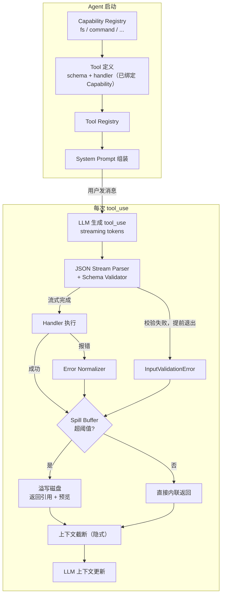

# Agent & Tool 生命周期

## 两个生命周期

**Agent 生命周期**（长，跨整个进程）：

```
Agent 启动
  → Init Capability Registry（fs / command / sandbox）
  → Register Tools（schema + handler，依赖 Capability）
  → Assemble System Prompt（tool descriptions 注入进去）
  → 进入对话循环
```

**Tool 生命周期**（短，每次 tool_use）：

```
LLM 生成 tool_use → 校验 → 执行 → 返回结果
```

细粒度流程：



Capability Registry 必须在 System Prompt 组装之前就绪，顺序是强约束的：

```
Capability Registry ready
        ↓
Tool Registry ready（schema + handler 注册完）
        ↓
System Prompt 组装（工具描述注入）
        ↓
第一次 LLM call 才能发出
```

## 启动时需要完成什么

| | Schema 注册 | Handler 初始化 |
|--|--|--|
| 必须在启动时完成？ | **是**，System Prompt 需要描述所有工具 | 不一定，handler 通常是纯函数，无状态 |

真正需要在启动时 ready 的是 **Capability**（fs/command 可能涉及沙箱建立、权限检查），不是 handler 本身。

## 动态注册

两种注入位置都需要支持：

```
静态 Tool  → System Prompt（Agent 身份的一部分）
动态 Tool  → 后续位置（user message / tool result 中追加）
```

动态注入不改 System Prompt，在合适位置补充 tool schema 描述，LLM 照样可以调用。

### Refresh 流程

**轻量 refresh**（动态 Tool 增删）：
```
Tool 增删
  → 更新 Dynamic Tool Registry
  → 下一个 turn 重新组装注入内容
  → 无需重启
```

**重量 refresh**（静态 Tool 变更）：
```
重建 System Prompt
  → 清空对话上下文（或保留摘要）
  → 重启 Agent 会话
```

### 注入位置的语义

注入位置本身在传递语义：System Prompt 里的 tool 是"天生能力"，后填进来的是"临时能力"。两种都得支持，具体哪个 tool 走哪条路后面再定。
